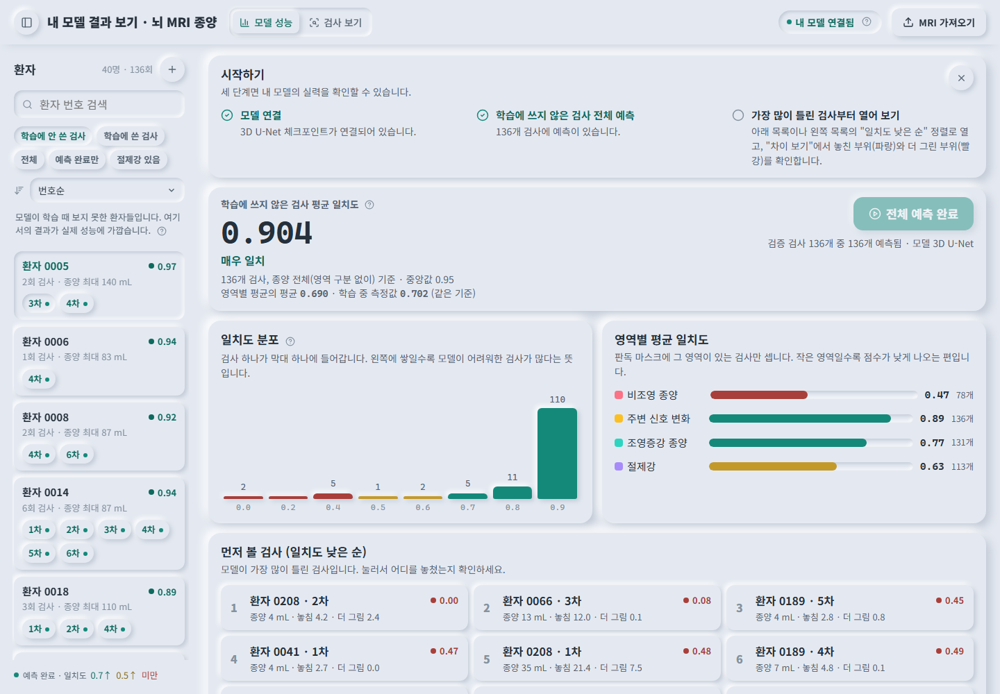
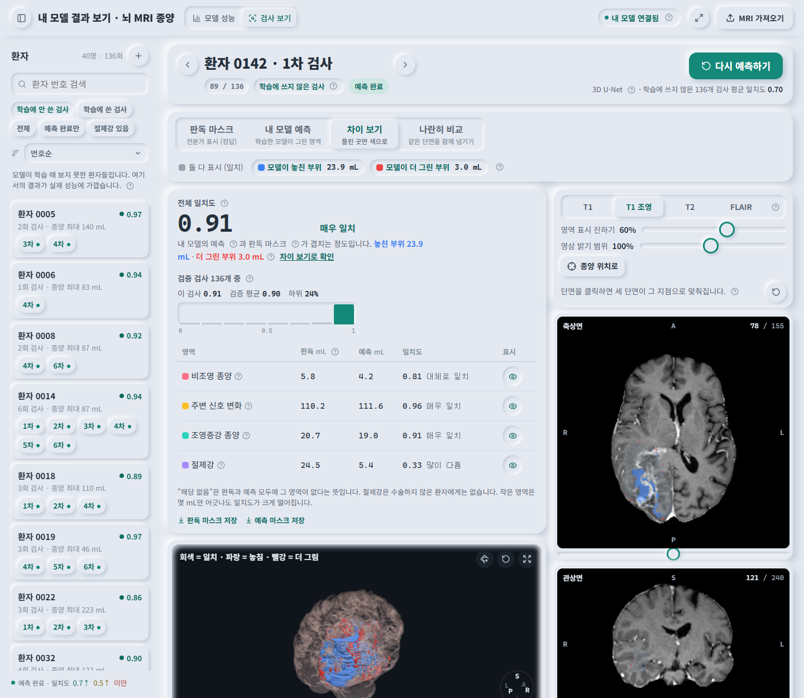

# BrainMRISegmentation_3D

**치료 후 교종(뇌종양) MRI를 3D U-Net으로 분할하고, 학습에 쓰지 않은 검사에서 모델이 어디서 맞고 어디서 틀리는지 웹에서 확인하는 엔드투엔드 프로젝트입니다.** 데이터 점검 → 학습 파이프라인 최적화 → 모델 학습 → 검증 세트 전체 평가 → 비전문가도 읽을 수 있는 결과 뷰어까지, 한 사람이 단일 PC(RTX 5080)에서 처음부터 끝까지 만들었습니다.

[](#) [](#) [](#) [](#) [](#) [](#)



*첫 화면. 검증 검사 136개 전체를 한 번에 예측하고, 평균 일치도·분포·영역별 평균·먼저 볼 검사를 보여 줍니다.*



*한 검사의 차이 보기. 판독과 예측이 일치한 곳은 회색, 모델이 놓친 부위는 파랑, 더 그린 부위는 빨강으로 단면과 3D에 함께 그립니다.*

## 핵심 결과

| 항목 | 결과 |
| --- | --- |
| 데이터 | [MU-Glioma-Post](https://www.cancerimagingarchive.net/collection/mu-glioma-post/) 571개 검사(환자 200명) · 학습 435 / 검증 136, 환자 단위 분리 |
| 모델 | MONAI residual 3D U-Net (32-64-128-256-320 채널, 12.9M 파라미터), T1·T1ce·T2·FLAIR 4채널 입력, 5클래스 출력 |
| 검증 Dice (라벨 4개 평균) | **0.702** · SNFH 0.89 · ET 0.77 · RC 0.60 · NETC 0.44 |
| 검증 Dice (종양 전체, 136개) | 평균 **0.904** · 중앙값 0.953 · 110개가 0.9 이상 |
| 학습 속도 | epoch당 25분 → **2.8분** (전처리 캐시 + 스레드 파이프라인 + bf16), GPU 사용률 1 % → 81~98 % |
| 추론 | 검사당 5.3초, 검증 136개 일괄 예측 12분 |

전체 실험 기록, 측정값, 트러블슈팅 16건은 **[연구 보고서](docs/research-log.md)**에 있습니다.

## 무엇을 만들었나

### 1. 데이터 점검과 학습 목록 (`scripts/`)
원본 2,978개 NIfTI를 전부 읽어 무결성·격자·라벨을 검사하고, 서로 다른 환자 ID 사이의 동일 MRI 11쌍과 시퀀스 의심 사례를 찾아 보류했습니다. 파일 내용이 같은 환자는 같은 분할 그룹에 두어 학습·검증 누수를 0으로 만들었습니다.

### 2. 학습 파이프라인 (`ml/`)
- RAS 정렬 · 1 mm 재표본 · 시퀀스별 z-score 전처리를 float16 `.npz`로 캐시(45.9 GB, 사례 읽기 3초 → 0.1초).
- 로더 스레드 4개 + producer 스레드 + pinned memory로 GPU를 포화시키는 크로스 케이스 패치 배칭.
- Dice+CE, AdamW, cosine 스케줄, bf16 autocast, 5 epoch마다 전체 볼륨 sliding-window 검증.
- GPU 증강(회전·크기·밝기·대비·감마·노이즈·블러)과 라벨 균등 패치 샘플링(작은 NETC 대응).
- 체크포인트에 전처리·채널 순서·라벨 의미를 함께 저장하고 추론 시 검증(`weights_only=True`).

### 3. 결과 검증 웹 (`backend/`, `frontend/`)
세 질문 순서로 설계했습니다. **모델이 전체적으로 얼마나 맞는가 → 어느 검사에서 틀리는가 → 그 검사에서 어디가 틀렸는가.**

| 화면 | 기능 |
| --- | --- |
| **모델 성능** | 검증 검사 전체 일괄 예측(순차 큐·진행률), 평균 일치도(종양 전체 / 영역별 평균), 분포 히스토그램, 먼저 볼 검사 10개 |
| **환자 목록** | 학습에 안 쓴 검사 기본 필터, 일치도 낮은 순·종양 큰 순 정렬, 예측 완료·절제강 필터, 검사마다 일치도 점과 숫자, `←`/`→`로 순서대로 이동 |
| **결과 카드** | 전체 일치도와 한 줄 판정, 놓친/더 그린 부피(mL), 검증 평균과 분포 속 위치(상위/하위 %), 영역별 판독/예측 부피와 일치도 |
| **뷰어** | 판독 마스크 / 내 모델 예측 / **차이 보기** / 나란히 비교. 3D(뇌 + 종양, 종양만 분리, 영역 펼쳐 보기, 공유 카메라)와 축상·관상·시상 단면. 단면 클릭 → 세 단면이 그 지점으로 이동하는 십자선 |
| **그 외** | 발표 모드, 진행 단계를 사람 말로("영상 준비 → 모델 계산 → 결과 저장"), 실패 원인 카드, 모든 전문 용어 옆 `?` 설명과 용어집, 시점별 부피, NIfTI 가져오기 |

원본 MRI는 복사하지 않고 manifest에서 **참조로 연결**하며(571개 2.7초), 단면은 uint8 볼륨을 한 번 받아 브라우저 캔버스에서 그려 휠 틱당 4 ms, 3D mesh는 gzip 결과를 캐시해 30 ms에 응답합니다. UI는 뉴모피즘(소프트 UI) 스타일이며 `?case=<id>&view=diff`로 특정 검사에 바로 갈 수 있습니다.

## 기술 스택과 구조

```text
data/ (원본, Git 미포함) ──► scripts/audit · prepare ──► manifest.json
                                                          │
            ┌─────────────────────────────────────────────┴──────────────┐
            ▼                                                            ▼
   ml/  cache → train (MONAI U-Net, bf16, GPU aug) → best.pt      backend/  FastAPI
        adapters: 체크포인트 검증 · sliding-window 추론 ◄──────────  store(참조 링크) · volumes(RAS, mesh, 지표)
                                                                    jobs / batch / overview / diff-mesh
                                                                         │ REST + gzip
                                                                         ▼
                                                                  frontend/  React 19 + three.js
                                                                  개요 · 목록 · 결과 카드 · 3D · 단면 · 차이 보기
```

| 영역 | 기술 |
| --- | --- |
| ML | PyTorch 2.14 + CUDA 13, MONAI 1.6, nibabel, scipy, scikit-image |
| 백엔드 | FastAPI, uvicorn, numpy, marching cubes(scikit-image), KD-tree HD95 |
| 프런트엔드 | React 19, TypeScript(strict), Vite 7, three.js 0.180, Canvas 2D 단면 렌더링 |
| 검증 | pytest 67개(백엔드·데이터 계약·ML), Node 테스트 19개, TypeScript 검사, 브라우저 검증 기록 |
| 환경 | Windows 11, RTX 5080 16 GB, Ryzen 7 9800X3D, 31 GB RAM |

## 빠르게 실행하기

Python 3.11 이상, Node.js 22 이상. PowerShell에서 프로젝트 폴더로 이동한 뒤:

```powershell
.\scripts\setup.ps1          # .venv 의존성 설치 + 웹 빌드
.\scripts\start.ps1          # API + 빌드된 웹을 http://127.0.0.1:8000 에서 제공
```

데이터 없이 실행하면 합성 뇌 1개로 UI를 둘러볼 수 있습니다(합성 데모의 점수는 실제 성능이 아닙니다). 실제 데이터와 학습한 모델까지 연결하는 순서:

1. **데이터**: [MU-Glioma-Post](https://www.cancerimagingarchive.net/collection/mu-glioma-post/)를 `data/MU-Glioma-Post/` 아래 원본 폴더 구조대로 둡니다([안내](docs/data-access.md)).
2. **점검·학습 목록**:
   ```powershell
   .\.venv\Scripts\python.exe -E scripts/audit_mu_glioma_post.py --data-root data/MU-Glioma-Post --output data/quality-check --workers 4
   .\.venv\Scripts\python.exe -E scripts/prepare_mu_glioma_post.py --audit data/quality-check/audit.json --output-dir data --seed 42 --val-fraction 0.2
   ```
   `data/mu-glioma-post-manifest.json`이 생기면 서버가 시작할 때 571개 검사를 자동으로 연결합니다.
3. **학습** (`setup.ps1 -WithML`로 CUDA PyTorch 설치 후):
   ```powershell
   .\.venv\Scripts\python.exe -E -m ml.train --manifest data/mu-glioma-post-manifest.json --model unet3d --channels 32 64 128 256 320 --output runs/unet3d-32ch --epochs 150 --batch-size 2 --patch-size 160 160 160 --patches-per-case 8 --val-every 5 --amp --cosine --cache-dir runs/cache --prefetch 5 --loader-threads 4 --augment --balanced-sampling
   ```
4. **모델 연결**: `.env`에 `MRI_UNET_CHECKPOINT=runs/unet3d-32ch/best.pt`를 적고 서버를 다시 시작합니다. 첫 화면의 **전체 예측** 버튼으로 검증 136개를 한 번에 예측합니다.

옵션 설명과 RTX 5080 측정값은 [모델 학습 가이드](docs/model-study.md)에, 환경 변수 전체는 [.env.example](.env.example)에 있습니다.

## 개발과 검증

```powershell
.\scripts\start-dev.ps1                                   # API 8000 + Vite 5173
.\.venv\Scripts\python.exe -E -m pytest backend/tests ml/tests
npm --prefix frontend test
npm --prefix frontend run build
```

브라우저 검증(측정값·스크린샷 기준)은 [검증 기록](docs/verification.md)에, 좌표·지표 정의와 API 목록은 [아키텍처](docs/architecture.md)에, 웹 설계 원칙은 [UX 계획](docs/ux-plan.md)에 정리했습니다.

## 프로젝트 구조

```text
backend/app/      main.py(라우트·작업 큐·개요·차이 mesh) · store.py(참조 링크 저장소) · volumes.py(RAS·단면·mesh·지표)
backend/tests/    API·공간 좌표·연결 사례·일괄 예측/개요 테스트
ml/               train.py · data.py · cache.py · augment.py · models.py · adapters.py · export_nnunet.py · smoke.py
ml/tests/         데이터 계약 · 캐시 · 증강 테스트
frontend/src/     App.tsx · components/(Overview, PatientBrowser, CaseHeader, ResultCard, ExplainView, MeshViewer, SliceViewer, Timeline, Help)
                  volumes.ts(브라우저 단면 렌더링·차이 채색) · cameraSync.ts(3D 공유 카메라) · patients.ts(정렬·필터)
scripts/          audit_mu_glioma_post.py · prepare_mu_glioma_post.py · setup.ps1 · start.ps1 · start-dev.ps1
docs/             research-log.md(연구 보고서) · architecture.md · model-study.md · data-access.md · verification.md · ux-plan.md
```

`data/`(원본·학습 목록), `.data/`(사례 메타데이터·예측 마스크), `runs/`(캐시·체크포인트·로그)는 로컬에만 있고 Git에 포함하지 않습니다. **MU-Glioma-Post 데이터와 학습된 가중치는 저장소에 없습니다.**

## 한계와 다음 단계

- 단일 모델·단일 seed의 결과입니다. NETC(비조영 종양)는 절반 넘는 검사에서 놓치고, 10 mL 미만의 작은 잔존 종양이 주된 실패 유형입니다.
- 진행 중: 공간·밝기 증강 + 라벨 균등 샘플링 실행을 같은 검증 136개에서 비교해 더 나은 체크포인트를 연결합니다.
- 계획: 원본 격자 기준 사례별 평가 CSV, nnU-Net v2 기준선, 작은 종양을 위한 전경 가중 손실.
- 연구·학습용 로컬 도구이며 진단이나 치료 판단에 쓰지 않습니다. 로그인·공유·DICOM/PACS는 범위 밖입니다.

## 출처

데이터: [MU-Glioma-Post (TCIA)](https://www.cancerimagingarchive.net/collection/mu-glioma-post/). UI 문구 점검에는 [kill-ai-slop](https://github.com/yetone/kill-ai-slop)의 기준 문서를 사용했습니다(Apache-2.0).
