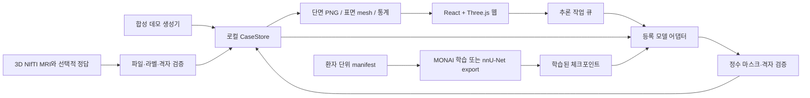

# 아키텍처와 데이터 흐름

이 MVP는 **React·Three.js 웹**, **FastAPI 볼륨 API**, **선택 설치하는 모델 학습·추론 모듈**로 나뉩니다. 기본 웹 열람은 CPU에서 동작합니다. 모델 가중치를 등록하면 같은 사례·마스크 계약 안에 실제 추론 결과가 추가됩니다.

## 모듈별 책임

| 모듈 | 책임 |
| --- | --- |
| [backend/app/main.py](../backend/app/main.py) | 파일 업로드, REST API, 같은 origin 쓰기 검사, 모델 목록, 단일 워커 추론 큐, SPA 서빙 |
| [backend/app/store.py](../backend/app/store.py) | 사례 ID와 메타데이터, NIfTI 파일, 분할 provenance, 192 MiB 제한의 읽기 캐시 |
| [backend/app/volumes.py](../backend/app/volumes.py) | NIfTI 격자 검증, RAS 변환, 단면 PNG, marching cubes, 부피·Dice·HD95, 결정적 합성 데모 |
| [frontend/src/App.tsx](../frontend/src/App.tsx) | 사례·시퀀스·마스크 선택, 업로드, 비교, 작업 상태, 모델 공부 화면 |
| [MeshViewer.tsx](../frontend/src/components/MeshViewer.tsx) | 실제 mm 좌표의 표면 표시, 카메라, 라벨별 표시와 펼침 |
| [SliceViewer.tsx](../frontend/src/components/SliceViewer.tsx) | 독립적인 세 단면 위치와 오버레이 요청 |
| [ml/schema.py](../ml/schema.py) | 네 채널 순서, 라벨 정의, 환자 분할 누출 검사 |
| [ml/data.py](../ml/data.py) | 모델 입력 spacing·정규화·패치 및 출력 격자 복원 |
| [ml/train.py](../ml/train.py) | 학습·전체 validation 볼륨 추론·체크포인트와 메타데이터 저장 |
| [ml/adapters.py](../ml/adapters.py) | 설정된 파일의 모델 레지스트리, 계약 검증, 모델별 추론 |

UI는 실제 `/api` 결과를 표시합니다. 기본 데이터는 명시적으로 `demo: true`인 수학적 phantom이며, 실데이터가 없는 상태를 가짜 환자나 학습 결과로 채우지 않습니다. demo 작업은 합성 기준 마스크를 결정적으로 변형한 결과를 다시 생성합니다.

## 데이터와 좌표 계약

### 웹 가져오기

`load_nifti`가 헤더·크기·finite 값·mm 단위·가역 affine을 먼저 검사합니다. `nib.as_closest_canonical`로 축을 RAS로 정리하며, 웹에서는 oblique/shear를 거절합니다. 정합된 입력의 축 교환·반전은 처리하지만 정합 자체를 수행하지는 않습니다. 다중 시퀀스와 마스크의 canonical shape·affine이 일치해야 사례를 저장합니다.

저장된 사례는 `.data/<case_id>/case.json`, `<modality>.nii.gz`, `seg-<segmentation_id>.nii.gz`로 구성됩니다. 메타데이터의 공간 단위는 mm, 방향은 RAS입니다. 다운로드하는 웹 마스크는 이 저장된 RAS 격자와 affine을 유지하며 업로드 파일의 원래 배열 축 순서까지 복원하지는 않습니다. 세계 좌표상의 정합은 유지합니다.

### 모델 입력과 출력

MONAI 입력 순서는 `[T1, T1ce, T2, FLAIR]`, 텐서 형태는 `[batch, channels, X, Y, Z]`입니다. `data.prepare_case`에서 RAS 정리, 학습에 지정된 spacing으로 재표본화, 시퀀스별 비영 복셀 z-score를 적용합니다. MRI는 선형 보간, 마스크는 최근접 보간을 사용합니다. 모델 출력 클래스 인덱스는 manifest의 실제 정수 라벨로 매핑합니다.

CLI 추론 출력은 입력 T1의 shape·affine으로 최근접 복원합니다. 웹에서 어댑터에 전달하는 T1은 이미 저장된 canonical RAS 파일이므로 웹 결과도 사례의 RAS 격자를 따릅니다. nnU-Net 어댑터는 저장된 plans의 reader/writer·전처리로 축 순서와 간격을 처리하고 출력 격자를 확인합니다.

웹 모델 연결은 MU-Glioma-Post의 `0=background, 1=NETC, 2=SNFH, 3=ET, 4=RC` 의미까지 일치해야 합니다. `generic` 프리셋은 열람에 사용할 수 있고, 실제 웹 추론은 `mu_glioma_post` 프리셋에 한정됩니다. MONAI 체크포인트는 architecture, 채널 순서, normalization, spacing, patch size, optimizer step을 검사합니다. 모델 파일이 있다는 상태와 실제 입력·가중치가 호환된다는 검사는 구분됩니다.

## 시각화와 수치 계산

- **단면:** RAS 배열의 axial/coronal/sagittal 단면을 방사선학적 방향으로 표시합니다. 복셀 간격으로 종횡비를 조정하고 긴 변 512 px의 PNG로 반환합니다. 각 단면의 위치는 독립적이며 연결 crosshair는 없습니다.
- **뇌 표면:** intensity 임계값과 큰 연결 성분으로 위치 참고용 외피를 만듭니다. 뇌 조직별 분할 결과는 아닙니다.
- **분할 표면:** 라벨별 이진 마스크에 marching cubes를 적용하고 full affine으로 vertex를 mm 좌표에 옮깁니다. 가장 긴 축이 약 128 복셀을 넘지 않도록 stride를 적용해 렌더링 부담을 줄입니다. 지나치게 복잡한 표면은 생성을 생략할 수 있습니다.
- **종양 분리:** 뇌 표면을 숨기고 라벨 mesh만 남깁니다. 펼침은 라벨 mesh의 표시 위치만 이동합니다. 복셀이나 파일을 변경하지 않습니다.
- **부피:** `라벨 복셀 수 × abs(det(affine[:3,:3])) / 1000`으로 mL를 계산합니다. 전체 부피는 `mask > 0`의 부피이며 RC 등을 포함할 수 있습니다. mesh 축소·표시 토글과 무관합니다.
- **연결 성분:** SciPy 기본 3D 연결 기준인 면을 공유하는 6방향 연결로 센 라벨별 성분 수입니다. 병변별 진단·추적 ID는 아닙니다.

### 평가 점수

서로 다른 마스크를 선택했을 때 전체 전경과 라벨별 Dice, HD95를 계산합니다. UI의 비교 요약은 전체 전경입니다. 같은 결과를 선택하면 자체 비교 점수를 표시하지 않습니다.

`Dice = 2 × |prediction ∩ reference| / (|prediction| + |reference|)`입니다. 웹 계산에서 둘 다 비어 있으면 Dice 1, 한쪽만 비면 0입니다. HD95는 이진 erosion으로 얻은 표면 복셀을 실제 mm 좌표로 옮긴 뒤, 양방향 최근접 거리들을 합친 분포의 95백분위수입니다. 한쪽이 비었거나 표면 점 총합이 100만 개를 넘으면 HD95를 `null`로 반환합니다.

이 HD95 구현은 표면 복셀 중심 기반이며 공식 챌린지의 lesion-wise 평가 구현과 동일하다고 가정하지 않습니다. 선택한 두 예측의 일치는 정답에 대한 정확도를 의미하지 않습니다. 학습 CLI는 재표본화된 validation 격자에서 클래스별 Dice를 계산하며, 둘 다 빈 클래스는 평균에서 제외합니다. 웹 지표와 CLI의 평균 조건이 다르므로 직접 같은 수치로 비교하지 않습니다.

## API

상세 스키마와 실행 가능한 요청 예시는 서버의 [OpenAPI 문서](http://127.0.0.1:8000/docs)를 사용합니다.

| 메서드 | 경로 | 역할 |
| --- | --- | --- |
| GET | `/api/health` | 서버 상태 |
| GET | `/api/label-presets` | 지원 라벨 의미와 색 |
| GET | `/api/cases` | 저장된 사례 목록 |
| POST | `/api/cases/import` | multipart `files`, `name`, `label_preset`으로 사례 업로드 |
| GET | `/api/cases/{case_id}` | 사례 격자·시퀀스·분할 목록 |
| GET | `/api/cases/{case_id}/slices/{plane}/{index}` | 0부터 시작하는 단면 PNG, 시퀀스·라벨·불투명도·윈도우 선택 |
| GET | `/api/cases/{case_id}/mesh` | 뇌 외피와 라벨별 vertex/face 배열 |
| GET | `/api/cases/{case_id}/stats` | 복셀 부피, 연결 성분, 선택적 비교 지표 |
| GET | `/api/cases/{case_id}/segmentations/{segmentation_id}/download` | 선택한 NIfTI 마스크 |
| GET | `/api/models` | 모델별 의존성·설정 상태와 미연결 사유 |
| POST | `/api/jobs` | `{case_id, model_id}`로 추론 요청 |
| GET | `/api/jobs` | 현재 프로세스의 작업 기록 |
| GET | `/api/jobs/{job_id}` | 작업 상태와 결과 segmentation ID |

## 실행 모델과 확장 경계

한 프로세스, 추론 워커 1개, 대기·실행 작업 최대 4개, 최근 작업 최대 100개를 사용합니다. 작업 큐는 메모리에 있으므로 서버 재시작 시 초기화됩니다. 완료한 분할 파일과 provenance는 사례 폴더에 남습니다. 진행률은 전처리·추론·저장 등의 단계 표시이며 GPU 내부 작업의 정확한 완료 비율은 아닙니다.

웹의 추론 조회는 `frontend/src/inferenceJob.ts`에서 요청 취소와 재시도를 관리합니다. 통신 오류·일시적인 서버 오류는 마지막 작업 상태를 유지한 채 별도로 안내하며, 완료한 사례와 작업 기록을 읽는 단계도 재시도합니다. 사례 전환이나 조회 종료 시 이전 요청을 취소하고 늦게 도착한 응답을 무시합니다. 작업 또는 결과가 사라진 404 등은 자동 조회를 멈추고 `작업·결과 다시 연결`로 사례·작업 목록을 다시 읽습니다. 연결 실패만으로 서버의 작업을 실패 상태로 변경하지 않습니다.

기본 주소는 `127.0.0.1`이며 로그인 없는 개인 로컬 워크스페이스입니다. 외부 공개·다중 사용자 사용에는 별도의 인증·권한·영속 작업 큐와 저장소 구성이 필요합니다. 사용자 웹 요청으로 체크포인트 경로를 받지 않고 서버 환경 변수로 등록합니다.

후속 확장은 아래 경계를 기준으로 추가할 수 있습니다.

1. **모델 추가:** `ml/models.py`와 `ml/adapters.py`에서 입력·출력 계약을 유지하고 모델별 metadata 검증을 추가합니다.
2. **데이터 연결:** MU-Glioma-Post의 실제 배포 구조를 확인해 파일 경로·환자 ID·검사 시점의 연결을 검증합니다.
3. **학습 모니터링:** 현재 `runs/metrics.json` 기록을 실험 저장소·영속 작업 큐와 연결합니다. 현 웹 탭은 학습 실행기가 아닙니다.
4. **정밀 뷰어:** 연결 crosshair, oblique reslicing, 볼륨 렌더링, 병변별 선택과 수동 편집을 추가합니다.
5. **검증:** 환자 단위 독립 홀드아웃, 원본 격자의 영역·병변별 평가, 동일 split의 nnU-Net/U-Net/Swin 비교를 구축합니다.
